<div align="center">


<a href="https://github.com/jasperBLCK">
  
</a>


</div>


<div align="center">
  
</div>


<h3 align="center"><code>&gt; stack</code></h3>

<div align="center">


<br/>


<br/>


<br/>


</div>

<h3 align="center"><code>&gt; security</code></h3>

```text
[+] auth done right ........ Keycloak SSO · JWT · OAuth 2.0 · RBAC
[+] network fundamentals ... TCP/IP · routing · DNS · HTTP
[+] osint tooling .......... IP intelligence lookup
[+] hardened deploys ....... Linux · Docker · least privilege · secrets out of code
[-] trust user input ....... never
```


<h3 align="center"><code>&gt; pinned</code></h3>

<div align="center">
  <a href="https://github.com/jasperBLCK/Revenue"></a>
  <a href="https://github.com/jasperBLCK/Nornikel_Hack2026"></a>
  <a href="https://github.com/jasperBLCK/VTBHACK-API-MultiBank"></a>
  <a href="https://github.com/jasperBLCK/youstagram_bot"></a>
  <a href="https://github.com/jasperBLCK/HH.RUWEB"></a>
  <a href="https://github.com/Makhkets/itpro"></a>
</div>


<h3 align="center"><code>&gt; stats</code></h3>

<div align="center">
  
  <br/>
  
</div>

<div align="center">
  <picture>
    <source media="(prefers-color-scheme: dark)" srcset="https://raw.githubusercontent.com/jasperBLCK/jasperBLCK/output/snake-dark.svg"/>
    
  </picture>
</div>


